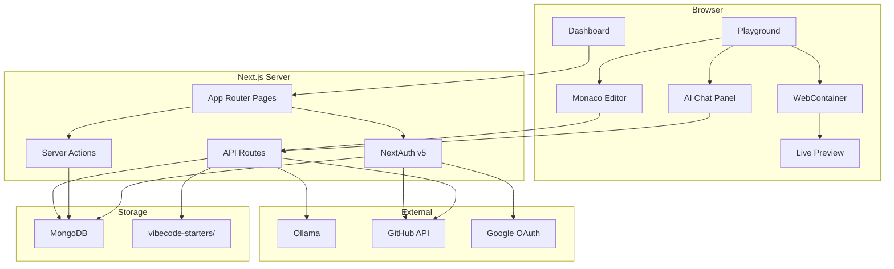

# VibeCode Editor

**VibeCode Editor** is a browser-based, AI-powered code playground. Sign in, create or import a project, edit in Monaco, get AI assistance, and see live previews — all without local setup.

Built with **Next.js 16**, **WebContainers**, **Monaco Editor**, **Ollama**, and **MongoDB**.

---

## Table of Contents

- [Overview](#overview)
- [Features](#features)
- [Architecture](#architecture)
- [Application Flow](#application-flow)
- [Project Structure](#project-structure)
- [Data Model](#data-model)
- [API & Server Actions](#api--server-actions)
- [Tech Stack](#tech-stack)
- [Getting Started](#getting-started)
- [Environment Variables](#environment-variables)
- [Deployment](#deployment)
- [Development Notes](#development-notes)

---

## Overview

VibeCode Editor is a full-stack web IDE for rapid prototyping. Users manage projects from a dashboard, write code in a Monaco-based editor, and run apps in-browser via WebContainers. AI features (inline completion and chat) are powered by a local Ollama instance.

| Concern | Solution |
|---------|----------|
| Code editing | Monaco Editor with tabs, themes, and file explorer |
| Live preview | WebContainers — mount files, install deps, run dev server |
| Persistence | MongoDB stores users, playgrounds, and file trees |
| Authentication | NextAuth v5 — GitHub & Google OAuth |
| AI assistance | Ollama — inline completion + chat sidebar |
| Project sources | Starter templates or GitHub repo import |

---

## Features

### Project Management

- Create playgrounds from 6 starter templates (React, Next.js, Express, Vue, Hono, Angular)
- Import existing GitHub repositories
- Star, rename, duplicate, and delete projects from the dashboard

### Editor

- Monaco-based code editor with syntax highlighting and multiple themes
- File explorer with create, rename, delete for files and folders
- Tabbed editing with unsaved-change indicators
- Save individual files or all open files (`Ctrl+S`)

### Live Preview

- In-browser Node.js runtime via WebContainers
- Automatic `npm install` and dev server startup
- Live preview iframe + integrated terminal (xterm.js)

### AI

- Inline code completion (Copilot-style) via monacopilot + Ollama
- Conversational chat sidebar with model selection
- Toggle AI features on/off from the playground toolbar

### Auth & Integrations

- Sign in with GitHub or Google
- GitHub OAuth with repo scope for repository import
- Per-user project isolation

---

## Architecture



### Key Modules

| Module | Path | Responsibility |
|--------|------|----------------|
| **auth** | `modules/auth/` | Session helpers, sign-in UI, user lookup |
| **dashboard** | `modules/dashboard/` | Project CRUD, starring, GitHub import UI |
| **playground** | `modules/playground/` | Editor, file explorer, load/save logic |
| **webcontainers** | `modules/webcontainers/` | Preview setup, terminal, file system transform |
| **ai-chat** | `modules/ai-chat/` | Chat sidebar, markdown rendering |

### Client State

| Hook / Store | Purpose |
|--------------|---------|
| `useFileExplorer` (Zustand) | File tree, open tabs, active file, unsaved flags |
| `usePlayground` | Load playground from DB, save template data |
| `useWebContainer` | Boot WebContainer singleton, sync file writes |

---

## Application Flow

### End-to-end user journey

```
Sign In → Dashboard → Create / Import Project → Playground → Edit → Save → Live Preview
```

### 1. Authentication

Users sign in at `/auth/sign-in` via GitHub or Google. NextAuth creates or links a `User` and `Account` record in MongoDB. GitHub sign-in requests `repo` scope so repositories can be imported later. Sessions use JWT strategy.

### 2. Creating a Playground

From the dashboard, users pick a template and title. A `Playground` record is created in MongoDB and the user is redirected to `/playground/:id`.

On first load, if no saved files exist, the app calls `GET /api/template/:id`, which scans the matching starter in `vibecode-starters/` and returns a JSON file tree.

### 3. Importing from GitHub

Users with a linked GitHub account can browse their repos and import one. The server fetches the repo tree and file contents via the GitHub API, converts them into the internal file tree format, and stores everything in a new `Playground` + `TemplateFile`.

### 4. Editing & Saving

The playground loads the file tree into the file explorer. Users open files in Monaco tabs, edit content, and save with `Ctrl+S`.

On save:

1. Content is written to the WebContainer filesystem (keeps preview in sync)
2. The full file tree is upserted to `TemplateFile.content` in MongoDB

### 5. Live Preview

When the playground opens, WebContainer:

1. Transforms the file tree into a mountable filesystem
2. Runs `npm install`
3. Runs `npm run start`
4. Renders the dev server URL in an iframe

Terminal output is streamed to an xterm.js panel below the preview.

### 6. AI Features

**Inline completion** — Monaco triggers monacopilot, which calls `POST /api/code-completion`. The server sends editor context to Ollama and returns a completion snippet.

**Chat** — The AI sidebar sends messages to `POST /api/chat` with conversation history. Responses are rendered as markdown (GFM + math support).

Both features can be toggled independently from the playground toolbar.

---

## Project Structure

```
vide-code-editor/
├── app/
│   ├── (auth)/auth/              Sign-in pages
│   ├── (root)/                   Landing page
│   ├── dashboard/                Project dashboard
│   ├── playground/[id]/          Main IDE
│   └── api/
│       ├── auth/                 NextAuth handlers
│       ├── chat/                 AI chat endpoint
│       ├── code-completion/      Inline AI completion
│       ├── template/[id]/        Starter template loader
│       └── github/               Repo list, import, file access
│
├── modules/
│   ├── auth/                     Authentication
│   ├── dashboard/                Project management
│   ├── playground/               Editor & file explorer
│   ├── webcontainers/            Preview & terminal
│   ├── ai-chat/                  Chat panel
│   └── home/                     Landing page components
│
├── components/ui/                shadcn/ui components
├── lib/                          Shared utilities (db, github, templates)
├── vibecode-starters/            On-disk project templates
├── prisma/schema.prisma          Database schema
├── auth.ts                       NextAuth configuration
└── auth.config.ts                OAuth provider setup
```

---

## Data Model

```
User
 ├── Playground[]          (owned projects)
 ├── StarMark[]            (starred projects)
 ├── ChatMessage[]         (AI chat history)
 └── Account[]             (OAuth providers)

Playground
 ├── TemplateFile          (1:1 — JSON file tree)
 └── StarMark[]

TemplateFile
 └── content (JSON)        Serialized file/folder tree
```

### File Tree Format

Source code is stored as a nested JSON structure, not individual DB rows:

```json
{
  "folderName": "Root",
  "items": [
    {
      "filename": "App",
      "fileExtension": "tsx",
      "content": "export default function App() { ... }"
    },
    {
      "folderName": "components",
      "items": []
    }
  ]
}
```

### Starter Templates

| Template | Source Directory |
|----------|-----------------|
| REACT | `vibecode-starters/react-ts` |
| NEXTJS | `vibecode-starters/nextjs-new` |
| EXPRESS | `vibecode-starters/express-simple` |
| VUE | `vibecode-starters/vue` |
| HONO | `vibecode-starters/hono-nodejs-starter` |
| ANGULAR | `vibecode-starters/angular` |

---

## API & Server Actions

### REST Endpoints

| Method | Route | Description |
|--------|-------|-------------|
| `POST` | `/api/chat` | AI chat — `{ message, history?, model? }` |
| `POST` | `/api/code-completion` | Inline completion (Monacopilot format) |
| `GET` | `/api/template/:id` | Load starter template for a playground |
| `GET` | `/api/github/repos` | List user's GitHub repositories |
| `POST` | `/api/github/import` | Import repo — `{ owner, repo, branch }` |
| `GET/POST` | `/api/auth/[...nextauth]` | NextAuth OAuth handlers |

### Server Actions

| Action | Module | Description |
|--------|--------|-------------|
| `createPlayground` | dashboard | Create new project |
| `getAllPlaygroundForUser` | dashboard | List user's projects |
| `deleteProjectById` | dashboard | Delete a project |
| `editProjectById` | dashboard | Update title / description |
| `duplicateProjectById` | dashboard | Clone a project |
| `toggleStarMarked` | dashboard | Star / unstar a project |
| `getPlaygroundById` | playground | Load project and files |
| `SaveUpdatedCode` | playground | Persist file tree to database |
| `currentUser` | auth | Get authenticated session user |

---

## Tech Stack

| Category | Technology |
|----------|-----------|
| Framework | Next.js 16 (App Router) |
| Language | TypeScript |
| UI | React 19, Tailwind CSS 4, shadcn/ui |
| Editor | Monaco Editor, monacopilot |
| Runtime | WebContainers (`@webcontainer/api`) |
| Terminal | xterm.js |
| State | Zustand |
| Auth | NextAuth v5 (Auth.js) |
| Database | MongoDB + Prisma 6 |
| AI | Ollama (local LLM) |
| Markdown | react-markdown, remark-gfm, KaTeX |

---

## Getting Started

### Prerequisites

- **Node.js** 20+
- **MongoDB** (local or Atlas)
- **Ollama** with models installed:

  ```bash
  ollama pull qwen2.5-coder:3b
  ```

- **OAuth apps** (GitHub and/or Google) for authentication

### Install & Run

```bash
git clone <repo-url>
cd vide-code-editor
npm install
npx prisma db push
npm run dev
```

Open [http://localhost:3000](http://localhost:3000).

### Scripts

| Command | Description |
|---------|-------------|
| `npm run dev` | Development server |
| `npm run build` | Production build |
| `npm start` | Production server |
| `npm run lint` | ESLint |

---

## Environment Variables

```env
# Required
DATABASE_URL="mongodb+srv://..."
AUTH_SECRET="openssl rand -base64 32"

# OAuth (at least one provider)
AUTH_GITHUB_ID=""
AUTH_GITHUB_SECRET=""
AUTH_GOOGLE_ID=""
AUTH_GOOGLE_SECRET=""

# Ollama (optional — defaults shown)
OLLAMA_URL="http://127.0.0.1:11434/api/generate"
OLLAMA_CODE_MODEL="qwen2.5-coder:3b"
OLLAMA_CHAT_MODEL="qwen2.5-coder:3b"
```

**OAuth callback URLs:**

- GitHub: `http://localhost:3000/api/auth/callback/github`
- Google: `http://localhost:3000/api/auth/callback/google`

---

## Deployment

```bash
npm run build
npm start
```

**Production checklist:**

- [ ] Set all environment variables on the hosting platform
- [ ] Configure MongoDB Atlas connection string
- [ ] Update OAuth callback URLs to the production domain
- [ ] Ensure Ollama is reachable from the server (or swap to a hosted LLM API)
- [ ] Set WebContainer headers: `Cross-Origin-Opener-Policy: same-origin` and `Cross-Origin-Embedder-Policy: require-corp`
- [ ] Run `npx prisma db push` against the production database

---

## Development Notes

- **File storage** — Playground source is a single JSON blob in `TemplateFile.content`, not per-file DB records. Starters are scanned from disk on first load.
- **WebContainer singleton** — One instance is shared per browser session and reused across file writes.
- **AI models** — Chat models are defined in `lib/chat-models.ts`. Code completion model is set via `OLLAMA_CODE_MODEL`.
- **Auth enforcement** — No global middleware; each Server Action and API route checks the session independently.
- **Known gaps** — Project duplication does not yet copy saved file content. Chat API has a hardcoded Ollama fallback URL in one code path.

---

## License

Private project — all rights reserved.
